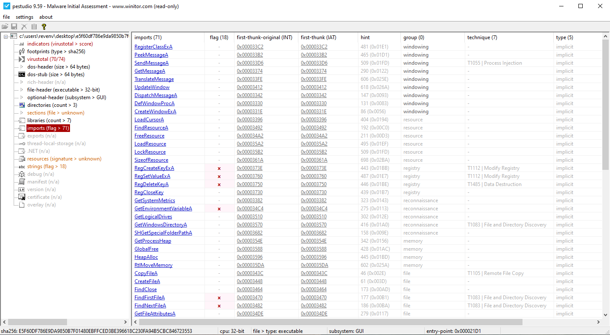
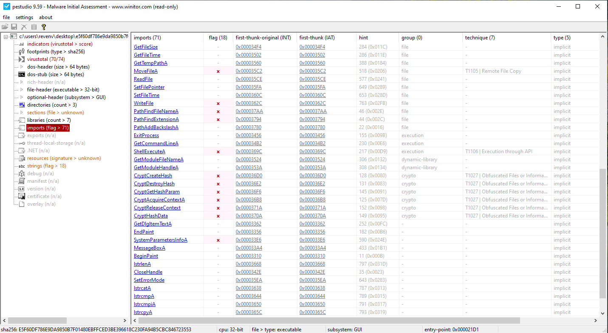
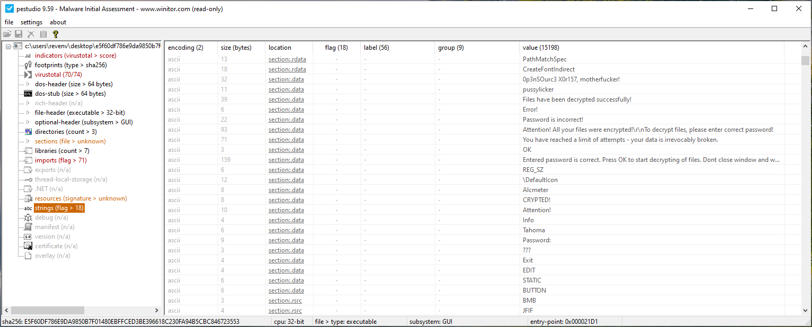
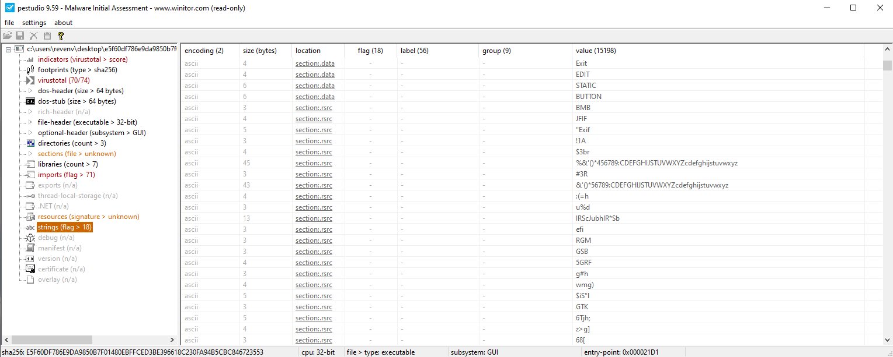
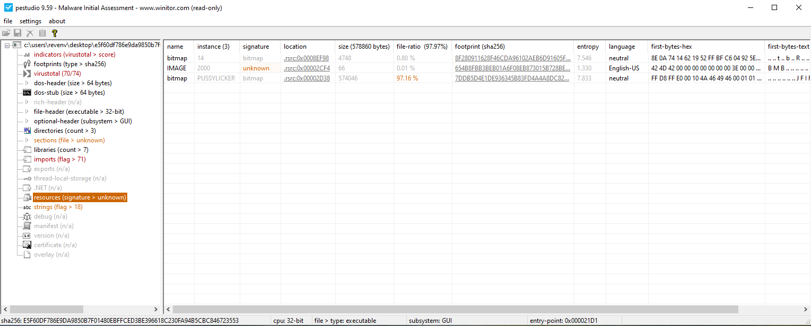
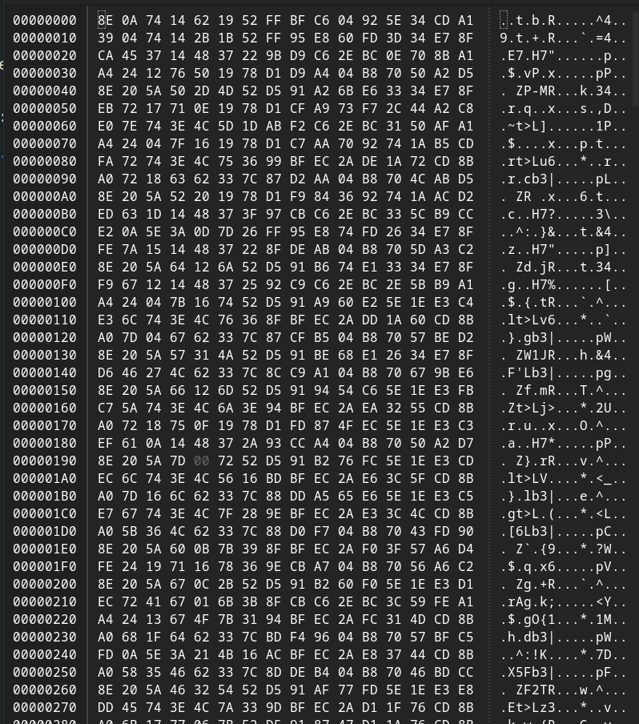
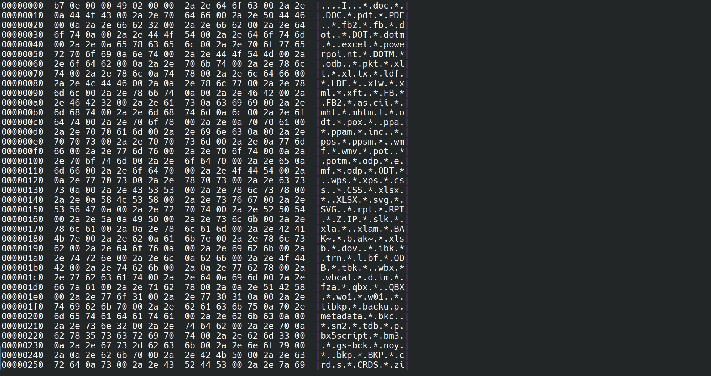
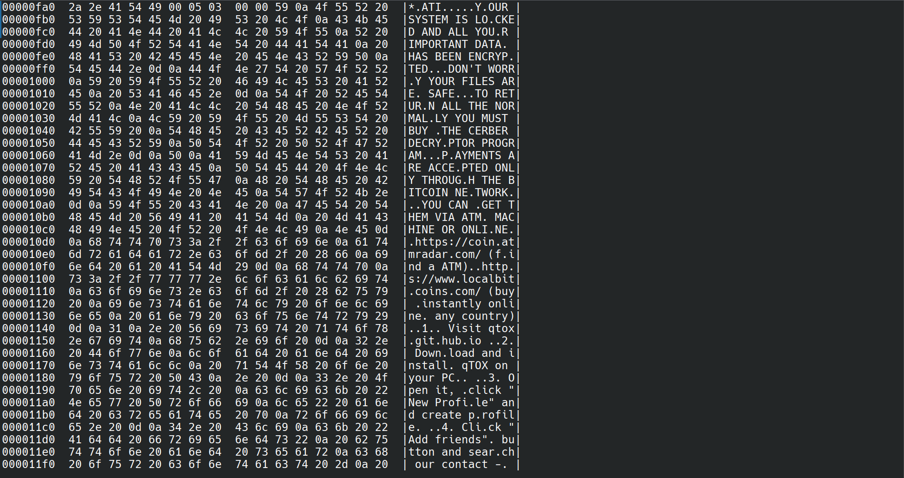

# e5f60df786e9da9850b7f01480ebffced3be396618c230fa94b5cbc846723553

## Download URL

https://bazaar.abuse.ch/sample/e5f60df786e9da9850b7f01480ebffced3be396618c230fa94b5cbc846723553/

## Static Analysis

### File Hashes

| Hash Type     | Hash Value                                                                                                 |
|---------------|------------------------------------------------------------------------------------------------------------|
| **SHA256**    | `e5f60df786e9da9850b7f01480ebffced3be396618c230fa94b5cbc846723553`                                         |
| **SHA3-384**  | `b84fdf4dc3d45f6ed547c43620700796d6ca2074aa4a837305a4a036bb11ca5fad9fd84ed70fdb4005ea2cf0198524a8`         |
| **SHA1**      | `5d4b97bbf2ca874b5924ec489c90a2e109ae2ad6`                                                                 |
| **MD5**       | `8b42ebfba0cb67a1164a15c6dae6fbef`                                                                         |


### Size and Entropy

* **Size**: 590848 bytes
* **Entropy**: 7.830

### Imported DDL's

* user32.dll
* kernel32.dll
* shell32.dll
* advapi32.dll
* shlwapi.dll
* gdi32.dll
* comctl32.dll


### Principal Imported Functions

* CryptAcquireContextA
* CryptCreateHash
* CryptDestroyHash
* CryptGetHashParam
* CryptHashData
* CryptReleaseContext
* ShellExecuteA
* ReadFile
* WriteFile
* GetFileSize
* FindFirstFileA
* FindNextFileA
* PathFindExtensionA
* PathFindFileNameA
* RegCloseKey
* RegCreateKeyExA
* RegDeleteKeyA






### Strings

| Section Type | Content                                                                                                     |
|--------------|-------------------------------------------------------------------------------------------------------------|
| `.text`      | `/c del`                                                                                                    |
| `.data`      | `HOW TO DECRYPT FILES.txt`                                                                                  |
| `.data`      | `SOFTWARE\Microsoft\Windows\CurrentVersion\Run`                                                             |
| `.data`      | `0p3nSOurc3 X0r157, motherfucker!`                                                                          |
| `.data`      | `pussylicker`                                                                                               |
| `.data`      | `Files have been decrypted successfully!`                                                                   |
| `.data`      | `Password is incorrect!`                                                                                    |
| `.data`      | `Attention! All your files were encrypted!\r\nTo decrypt files, please enter correct password!`             |
| `.data`      | `You have reached a limit of attempts - your data is irrevocably broken.`                                   |
| `.data`      | `Entered password is correct. Press OK to start decrypting of files. Dont close window and wait until message "Files have been decrypted successfully!" appears.` |
| `.data`      | `CRYPTED!`                                                                                                  |
| `.data`      | `Attention!`                                                                                                |






### Resource Section

This malware has in his resource section three files, beeing then:

* Image: with some instructions on how to contact the malware author to decrypt the files
* Bigger BMP: contains a lot of content like the ransom note, file extensions and other things
* Smaller BMP: nothing relevant




## Dynamic Analysis Overview

The first thing that this malware does is to recover the content of the biggest .BMP file in his resource section. After that he uses the first line of the file to decrypt the rest of the content.




We can achieve this result with this simple code:

```c
#include <stdio.h>

int main(const int argc, const char * argv[]) {
  FILE * pInputFile = NULL;
  unsigned int iKey[16] = { 0 }, iCurrentValue = 0, iCounter = 0;

  if(argc < 2) {
    printf("\"%s\" Usage: <INPUT FILE>\n", argv[0]);
    return 1;
  }

  pInputFile = fopen(argv[1], "rb");
  if(!pInputFile) {
    printf("[-] The program was not able to open/create the file!\n");
    return 1;
  }

  // The Decryption "Key" Bytes
  // 0x5E, 0x34, 0xCD, 0xA1, 0xBF, 0xC6, 0x04, 0x92, 0x62, 0x19, 0x52, 0xFF, 0x8E, 0x0A, 0x74, 0x14
  for(unsigned int i = 0; i < 16; i++)
    iKey[i] = fgetc(pInputFile);

  while((iCurrentValue = fgetc(pInputFile)) != EOF) {
    printf("%c", iCurrentValue ^ iKey[iCounter++]);

    if(iCounter > 0 && iCounter % 16 == 0) printf("\n");
    if((iCounter + 1)  == 17) iCounter = 0;
  }

  if(pInputFile)
    fclose(pInputFile);

  return 0;
}
```





Before continuing he reverse the bytes of the "Decryption Key" to use later.

He gets the timestamp of Last Edition, Created at and Last Open from the Explorer.exe application, so them every file that he creates or modify, it will set this timestamps.

He gets the path to the TEMP folder and his path, so it copies itself to address C:\Users\User\AppData\Local\Temp\ with name the name of `E7OKC9s3IlhAd13.exe` and it changes the file times (Creation, Last Edition, Last Open) with the sames of Explorer.exe.


Then he starts to modify/add some key on Windows Registry:

| Registry Key                                                                                                         | Value                                                                                       |
|----------------------------------------------------------------------------------------------------------------------|---------------------------------------------------------------------------------------------|
| HKEY_LOCAL_MACHINE\Software\Microsoft\Windows\CurrentVersion\Run                                                       | C:\Users\User\AppData\Local\Temp\E7OKC9s3IlhAd13.exe                                      |
| HKEY_CLASSES_ROOT\Software\Microsoft\Windows\CurrentVersion\Run                                                        | C:\Users\User\AppData\Local\Temp\E7OKC9s3IlhAd13.exe                                      |
| HKEY_CLASSES_ROOT\ZJKCLJAUDZDACP                                                                                    | CRYPTED!                                                                                   |
| HKEY_CLASSES_ROOT\ZJKCLJAUDZDACP\shell\open\command                                                                  | C:\Users\User\AppData\Local\Temp\E7OKC9s3IlhAd13.exe                                      |
| HKEY_CLASSES_ROOT\.Remember_you_got_only_24_hours_to_make_the_payment_if_you_dont_pay_prize_will_triple_Mortal_Kombat_Ransomware | ZJKCLJAUDZDACP                                                                            |
| HKEY_CLASSES_ROOT\ZJKCLJAUDZDACP\DefaultIcon                                                                         | C:\Users\User\AppData\Local\Temp\E7OKC9s3IlhAd13.exe,0                                   |


After that he get the logical drivers and runs through each one a recursive function that finds the next folder and files inside that folder. 

For every folder he verifies if already exists the ransom note, if not he creates.

He compares the extension of every file he encounters to verify if it has not been encrypted yet and if the file extension is in the "allowed extensions".

If he encounters a file that is not encrypted yet, he will prepare a string to be the new file name, that is the CURRENT NAME OF THE FILE + CUSTOM FILE EXTENSION. (Usually FILE_NAME.Remember_you_got_only_24_hours_to_make_the_payment_if_you_dont_pay_prize_will_triple_Mortal_Kombat_Ransomware)

He puts a file pointer in the beginning of the file, but he moves 0x4B in depth, and read up to maximum of 0x1A92F4 bytes.

Before start to encrypting the file content he creates a custom key to each file, being the XOR opertaion between the reversed bytes used to decrypt the content of resource section and the first letter of the file and some ROL operation as can be seeing below:

```c
#include <stdio.h>

int main() {
  unsigned char * FileName = "Lorem_ipsum.txt";
  unsigned int ReversedDecryptedKeyOfResourceSection[] = {0x14, 0x74, 0x0A, 0x8E, 0xFF, 0x52, 0x19, 0x62, 0x92, 0x04, 0xC6, 0xBF, 0xA1, 0xCD, 0x34, 0x5E};
  unsigned int FileInitialLetter = FileName[0];
  unsigned int Result[16] = { 0 };

  for(int i = 0, j = 0; i < 16; i++) {
    Result[i] = (FileInitialLetter ^  ReversedDecryptedKeyOfResourceSection[j]) & 0x000000FF;
    FileInitialLetter = (FileInitialLetter << 1) | (FileInitialLetter >> 7) & 0xFF;
    j++;
	}

	return 0;
}
```

Then he starts to encrypt the file content with something similar as can be seeing below:


```c
void XorEncryption(PBYTE pFileContent, PBYTE pToXORReversedKeyWithFileFirstLetter, DWORD dwBytesRead) {
        UINT FirstFourBytes = 0x0, Ebx = 0x0, SecondFourBytes = 0x0, iCounter = 0x0;

        for (int i = (dwBytesRead >> 3); i != 0; i--) {

                FirstFourBytes = *(UINT*)(pFileContent + iCounter);
                SecondFourBytes = *(UINT*)(pFileContent + iCounter + 4);

                FirstFourBytes = _byteswap_ulong(FirstFourBytes);
                SecondFourBytes = _byteswap_ulong(SecondFourBytes);

                while (Ebx != (0x9E3779B9 * 0x10)) {
                        Ebx += 0x9E3779B9;

                        FirstFourBytes += (((SecondFourBytes << 4) + *(UINT*)(pToXORReversedKeyWithFileFirstLetter)) ^ (Ebx + SecondFourBytes)) ^ ((SecondFourBytes >> 5) + *(UINT*)(pToXORReversedKeyWithFileFirstLetter + 4));

                        SecondFourBytes += (((FirstFourBytes << 4) + *(UINT*)(pToXORReversedKeyWithFileFirstLetter + 8)) ^ (Ebx + FirstFourBytes)) ^ ((FirstFourBytes >> 5) + *(UINT*)(pToXORReversedKeyWithFileFirstLetter + 12));
                }

                *(UINT*)(pFileContent + iCounter) = _byteswap_ulong(FirstFourBytes);
                *(UINT*)(pFileContent + iCounter + 4) = _byteswap_ulong(SecondFourBytes);

                FirstFourBytes = 0x0;
                SecondFourBytes = 0x0;
                Ebx = 0x0;
                iCounter += 8;
        }
}
```

And based on that we can write the decryption code and would be something like:


```c
void XorDecryption(PBYTE pFileContent, PBYTE pToXORReversedKeyWithFileFirstLetter, DWORD dwBytesRead) {
        printf("\t\t\tInit Decryption XOR Function!\n");
        UINT FirstFourBytes = 0x0, Ebx = (0x9E3779B9 * 0x10), SecondFourBytes = 0x0, iCounter = 0x0;

        for(int i = (dwBytesRead >> 3); i != 0; i--) {
                FirstFourBytes = *(UINT*)(pFileContent + iCounter);
                SecondFourBytes = *(UINT*)(pFileContent + iCounter + 4);

                FirstFourBytes = _byteswap_ulong(FirstFourBytes);
                SecondFourBytes = _byteswap_ulong(SecondFourBytes);

                while (Ebx != 0x0) {

                        SecondFourBytes -= (((FirstFourBytes << 4) + *(UINT*)(pToXORReversedKeyWithFileFirstLetter + 8)) ^ (Ebx + FirstFourBytes)) ^ ((FirstFourBytes >> 5) + *(UINT*)(pToXORReversedKeyWithFileFirstLetter + 12));

                        FirstFourBytes -= (((SecondFourBytes << 4) + *(UINT*)(pToXORReversedKeyWithFileFirstLetter)) ^ (Ebx + SecondFourBytes)) ^ ((SecondFourBytes >> 5) + *(UINT*)(pToXORReversedKeyWithFileFirstLetter + 4));

                        Ebx -= 0x9E3779B9;
                }

                *(UINT*)(pFileContent + iCounter) = _byteswap_ulong(FirstFourBytes);
                *(UINT*)(pFileContent + iCounter + 4) = _byteswap_ulong(SecondFourBytes);

                FirstFourBytes = 0x0; 
                SecondFourBytes = 0x0;
                Ebx = (0x9E3779B9 * 0x10);
                iCounter += 8;
        }
}
```

